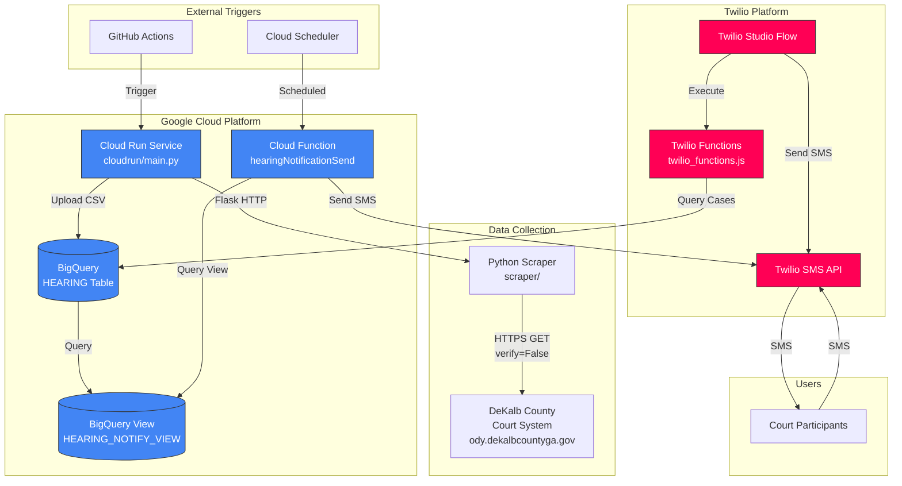
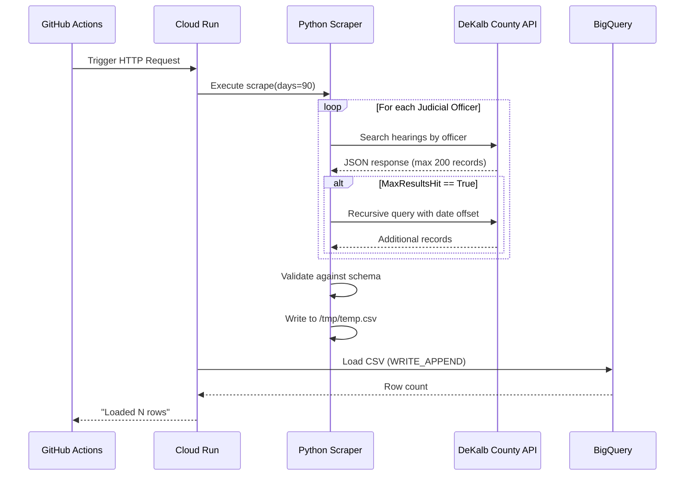
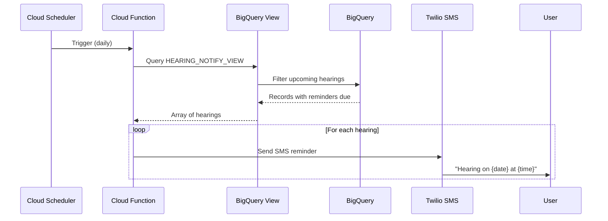
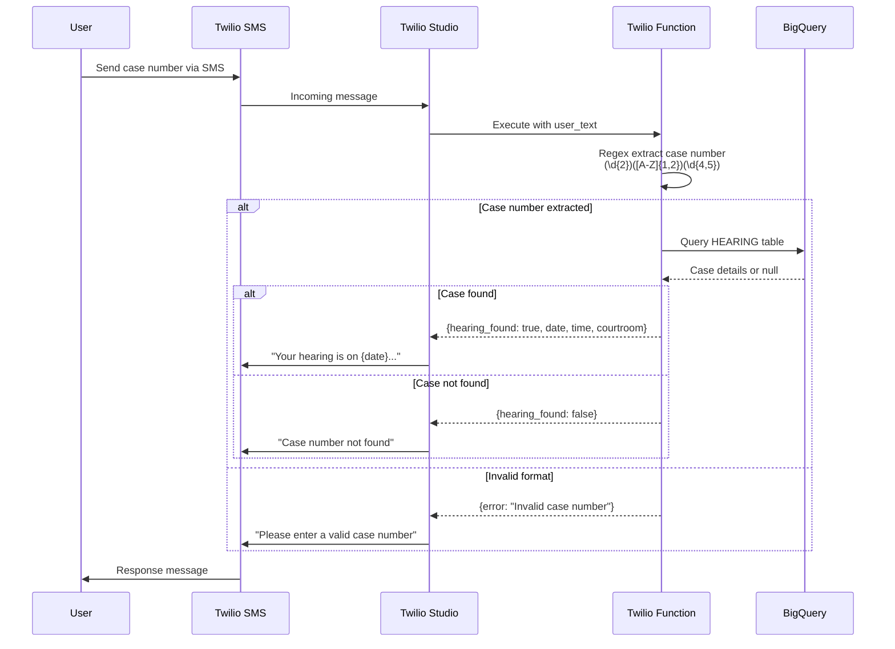
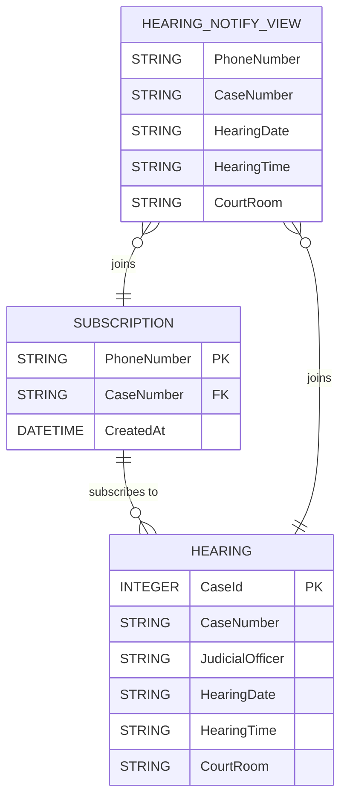

# Georgia CourtBot System Architecture

This document provides visual architecture diagrams for the Georgia CourtBot system.

## System Overview



## Data Flow: Scraping & Storage



## Data Flow: SMS Reminder System



## Data Flow: User Case Lookup



## Data Schema



## Technical Implementation Details

### File Structure & Entry Points

**Python Scraper Module (`scraper/`):**
- `scraper/__main__.py` - Click-based CLI with two commands: `scrape` and `upload`
- `scraper/data/dekalb_scraper.py` - Core web scraper implementation
  - Scrapes https://ody.dekalbcountyga.gov by judicial officer
  - Handles pagination via recursive queries when MaxResultsHit == True
  - Default lookback period: 90 days from current date
- `scraper/bigquery/commands.py` - BigQuery upload logic
  - Handles CSV to BigQuery table loading
  - Creates dataset if needed (raises Conflict if exists)
- `scraper/data/schema/case.json` - JSON Schema for case data validation

**Cloud Run Service (`cloudrun/main.py`):**
- Flask application entry point
- Execution flow:
  1. Redirects stdout to `/tmp/temp.csv`
  2. Executes `scraper.data.dekalb_scraper.run('csv', 90)`
  3. Closes file handle
  4. Loads CSV to BigQuery with `WRITE_APPEND` disposition
  5. Returns count: `"Loaded {N} rows"`
- Triggered by: GitHub Actions (`.github/workflows/`) or HTTP requests
- Environment variables: `PROJECT_ID`, `DATASET_ID`, `TABLE_ID`, `PORT`

**Twilio Integration:**
- `twilio/twilio_functions.js` - Serverless function for case lookup
  - Queries BigQuery to validate case numbers from SMS input
  - Uses regex: `(\d{2})([A-Z]{1,2})(\d{4,5})` or `([A-Z]{1})(\d{7})`
  - Returns hearing details or error messages
- `twilio/studio_flow.json` - Twilio Studio conversation flow definition
- `google/hearingNotificationSend/index.js` - Cloud Function for reminders
  - Queries BigQuery view: `HEARING_NOTIFY_VIEW` (view definition not in repository)
  - Sends SMS via Twilio API for all records returned by the view
  - Hardcoded phone number: `+19362593013`
  - **Implementation Note**: No date filtering in the function itself; relies on view logic

### BigQuery Schema Requirements

The case schema requires these **exact** fields in this format:

| Field | Type | Format | Example |
|-------|------|--------|---------|
| `CaseId` | INTEGER | Numeric ID | 123456 |
| `CaseNumber` | STRING | Alphanumeric | 22CR12345 |
| `JudicialOfficer` | STRING | Full name | Smith, John A. |
| `HearingDate` | STRING | MM/DD/YYYY | 01/15/2024 |
| `HearingTime` | STRING | Time string | 9:00 AM |
| `CourtRoom` | STRING | Location | Courtroom 3A |

**Important:**
- Schema auto-detection on first load
- `WRITE_APPEND` disposition (no deduplication)
- Data validation occurs before upload via `jsonschema` library

### Twilio Setup Requirements

**Service Account Configuration:**
1. Create GCP service account with these roles:
   - BigQuery Data Viewer
   - BigQuery Job User

2. Download service account JSON key

3. Upload to Twilio as **private asset** (not protected):
   - Asset name: `gcp_service_account.json` (exact name required)
   - Mode: Private (accessible to functions)
   - Path referenced in code: `Runtime.getAssets()["/gcp_service_account.json"].path`

**Node.js Dependencies:**
- `@google-cloud/bigquery` version 5.10.0+ (check [NPM](https://www.npmjs.com/package/@google-cloud/bigquery) for latest)
- `twilio` version 3.73.1+

**Environment Variables (Twilio):**
- `TWILIO_ACCOUNT_SID` - Account identifier
- `TWILIO_AUTH_TOKEN` - Authentication token
- `GOOGLE_APPLICATION_CREDENTIALS` - Set automatically from asset path

### External Dependencies

**Python (`requirements.txt`):**
| Package | Version | Purpose |
|---------|---------|---------|
| `beautifulsoup4` | 4.10.0 | HTML parsing for court website scraping |
| `google-cloud-bigquery` | 2.32.0 | BigQuery client library |
| `flask` | 2.0.2 | Web framework for Cloud Run service |
| `gunicorn` | 20.1.0 | WSGI HTTP server for Cloud Run |
| `click` | 8.0.3 | CLI framework for scraper commands |
| `jsonschema` | 4.4.0 | Data validation against schema |
| `requests` | 2.27.1 | HTTP library for web scraping |

**Node.js (Google Cloud Function - `google/hearingNotificationSend/package.json`):**
| Package | Version | Purpose |
|---------|---------|---------|
| `@google-cloud/bigquery` | 5.10.0 | BigQuery queries from Cloud Function |
| `twilio` | 3.73.1 | SMS messaging API |

### Data Processing Flow

1. **Scraper** → Fetches hearing data from DeKalb County court system
   - Iterates through all judicial officers (to handle 200 record API limit)
   - Handles pagination when `MaxResultsHit == True`
   - Extracts only fields of interest from full API response

2. **Validation** → Validates against JSON schema
   - Fields: CaseId, CaseNumber, HearingDate, HearingTime, CourtRoom, JudicialOfficer
   - Validation errors halt the process

3. **BigQuery Storage** → Data stored in GCP BigQuery
   - Table created with schema auto-detection on first load
   - `WRITE_APPEND` disposition adds to existing data
   - No deduplication at storage level

4. **Cloud Run Execution** → Scheduled runs via GitHub Actions
   - Appends new data to existing dataset
   - Returns row count for monitoring

5. **Notification System** → Google Cloud Function queries `HEARING_NOTIFY_VIEW`
   - View is expected to filter for hearings requiring reminders (intended: 7 days and 1 day before)
   - Sends SMS via Twilio API for each record returned by the view
   - **Note**: View definition and Cloud Scheduler configuration not version-controlled in this repository

6. **User Interaction** → Twilio Functions handle inbound SMS
   - Regex extracts case number from user message
   - Queries BigQuery `HEARING` table for matching cases
   - Returns hearing details or "not found" message

### Hardcoded Values & Constants

**Configuration Constants:**
- Twilio phone number: `+19362593013` (in `google/hearingNotificationSend/index.js`)
- BigQuery view: `cfa-georgia-courtbot.STG.HEARING_NOTIFY_VIEW` (definition not in repository)
- BigQuery table: `cfa-georgia-courtbot.STG.HEARING`
- BigQuery subscription table: `cfa-georgia-courtbot.STG.SUBSCRIPTION` (referenced but not created in code)
- Default scrape period: 90 days
- Intended reminder schedule: 7 days and 1 day before hearing (per documentation)
- Studio flow mentions: 3 days and 1 day ahead (in `twilio/studio_flow.json:106`)

**URL Endpoints:**
- DeKalb County portal: `https://ody.dekalbcountyga.gov/portal/`
  - Dashboard: `/Home/Dashboard/26`
  - Search: `/Hearing/SearchHearings/HearingSearch`
  - Results: `/Hearing/HearingResults/Read`

**Case Number Regex Patterns:**
- Pattern 1: `(\d{2})([A-Z]{1,2})(\d{4,5})` - Example: 22CR12345, 23M1234
- Pattern 2: `([A-Z]{1})(\d{7})` - Example: C1234567

## Implementation Notes

- **SSL Verification**: Disabled for DeKalb County scraping due to incomplete certificate chain (workaround in code: `session.verify = False`)
- **API Limits**: DeKalb County API limits results to ~200 records per query; handled via judicial officer iteration
- **Reminder Timing**: Intended to send at 7 days and 1 day before hearing, but timing logic not implemented in version-controlled code
- **Data Append**: Scraper uses `WRITE_APPEND` to BigQuery; no deduplication at storage level
- **Case Number Patterns**: Supports two regex formats for case number extraction
- **User Agent**: Custom header `"User-Agent": "CodeForAtlanta Court Bot"` for scraping requests

## Missing Infrastructure (Not in Repository)

The following infrastructure exists in the deployed environment but is not version-controlled:

### 1. BigQuery View: `HEARING_NOTIFY_VIEW`
**Purpose**: Filters hearings that need reminders sent today

**Expected SQL** (not confirmed, inferred from usage):
```sql
CREATE VIEW `cfa-georgia-courtbot.STG.HEARING_NOTIFY_VIEW` AS
SELECT
    s.PhoneNumber,
    h.CaseNumber,
    h.HearingDate,
    h.HearingTime,
    h.CourtRoom
FROM `cfa-georgia-courtbot.STG.HEARING` h
JOIN `cfa-georgia-courtbot.STG.SUBSCRIPTION` s
    ON h.CaseNumber = s.CaseNumber
WHERE DATE_DIFF(PARSE_DATE('%m/%d/%Y', h.HearingDate), CURRENT_DATE(), DAY) IN (7, 1)
-- Alternative interpretation based on studio_flow.json: IN (3, 1)
```

**Referenced in:**
- `google/hearingNotificationSend/index.js:16`

### 2. BigQuery Table: `SUBSCRIPTION`
**Purpose**: Stores phone numbers subscribed to case reminders

**Expected Schema** (inferred from ER diagram):
```sql
CREATE TABLE `cfa-georgia-courtbot.STG.SUBSCRIPTION` (
    PhoneNumber STRING NOT NULL,
    CaseNumber STRING NOT NULL,
    CreatedAt DATETIME NOT NULL
)
```

**Referenced in:**
- Architecture documentation
- Expected to be joined with `HEARING` table in `HEARING_NOTIFY_VIEW`

### 3. Cloud Scheduler: Notification Trigger
**Purpose**: Triggers `hearingNotificationSend` Cloud Function daily

**Expected Configuration:**
```yaml
Schedule: "0 12 * * *"  # Daily at noon UTC (7am EST) - timing not confirmed
Target: hearingNotificationSend Cloud Function
HTTP Method: POST or GET
Service Account: GCP service account with Cloud Functions Invoker role
```

**Current State:**
- Cloud Scheduler exists for **scraper** (`.github/workflows/deploy_to_gcr.yaml:105`)
- No Cloud Scheduler configuration for notification function in repository

### 4. Twilio Studio Flow Webhook
**Purpose**: Connects Twilio Studio to Cloud Function

**Configuration Required:**
- Webhook URL pointing to deployed `hearingNotificationSend` function
- Authentication setup between Twilio and GCP

## Recommended Next Steps

To make the system fully reproducible:

1. **Export and commit BigQuery view definition** for `HEARING_NOTIFY_VIEW`
2. **Create and commit SQL schema** for `SUBSCRIPTION` table
3. **Add Terraform or gcloud commands** to create Cloud Scheduler for notifications
4. **Document or script Twilio Studio flow setup** with webhook configuration
5. **Resolve timing discrepancy**: Documentation says 7+1 days, studio_flow.json says 3+1 days
6. **Add GitHub workflow** for deploying notification function (currently only scraper deploys)
